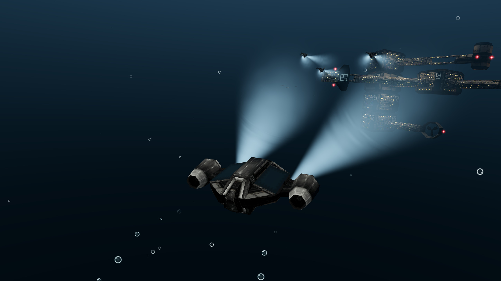
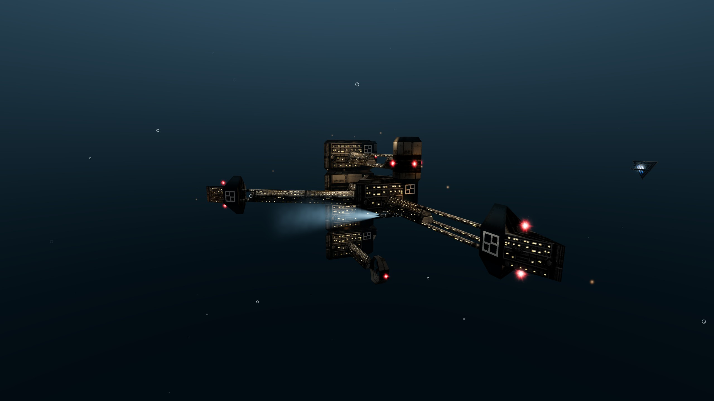
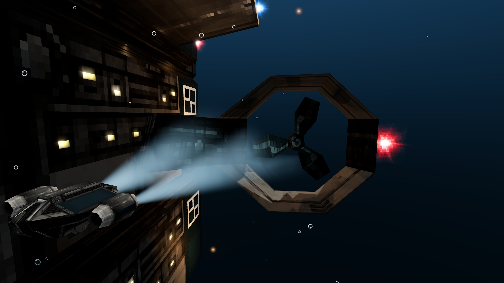
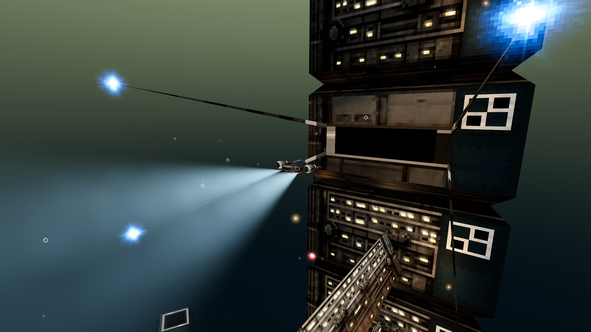
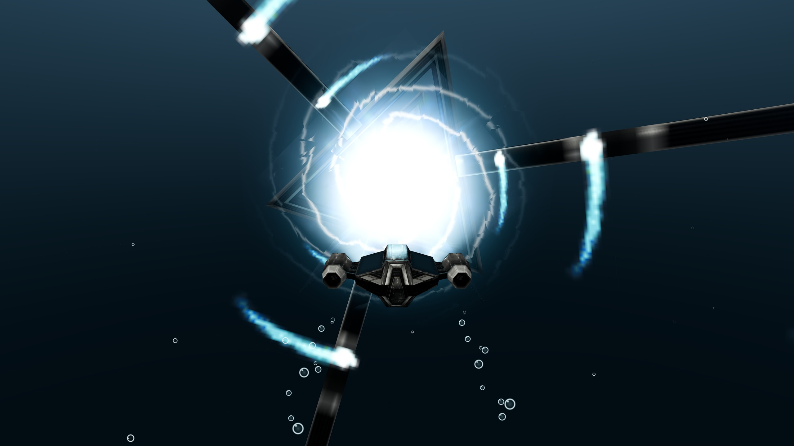

# Abyssal compatibility engine

Play **DEEP** as a modern desktop or browser game, using your own copy of the original.

Abyssal is a separate game engine, built in Godot, that reads a DEEP JAR you already own and converts it on your own machine. Submarine flight, stations, trading, missions and combat run natively, with modern lighting, gamepad and touch support, a readable interface and a world map with autopilot.

> **You need your own copy of DEEP.** No game data ships with this engine - no models, textures, music, sound or interface art. Nothing is downloaded for you. Without your own JAR there is nothing to play.

## What it looks like

[](https://github.com/TheWWWorm/abyssal/releases/download/v1.0.0/abyssal-engine-1.0.0-screenshot-headlights-off-rygg.png)

[](https://github.com/TheWWWorm/abyssal/releases/download/v1.0.0/abyssal-engine-1.0.0-screenshot-rygg-from-outside.png)

[](https://github.com/TheWWWorm/abyssal/releases/download/v1.0.0/abyssal-engine-1.0.0-screenshot-station-engine.png)

[](https://github.com/TheWWWorm/abyssal/releases/download/v1.0.0/abyssal-engine-1.0.0-screenshot-leaving-the-berth.png)

[](https://github.com/TheWWWorm/abyssal/releases/download/v1.0.0/abyssal-engine-1.0.0-screenshot-stream-gate.png)

Each picture opens at its full 5120x2880. There is also a [one-minute trailer in 4K](https://github.com/TheWWWorm/abyssal/releases/download/v1.0.0/abyssal-engine-1.0.0-trailer-4k.mp4) - stations from outside and in, a departure, a fight, the gate - rendered by the engine itself from a converted copy of the game.

## Play in your browser

**[Play now at abyssal.wwworm.com](https://abyssal.wwworm.com/)** - nothing to install. Open the page, choose your own DEEP JAR, and it converts in your browser. Your JAR is never uploaded; the conversion runs entirely on your machine and the converted content stays in your browser's local storage.

Needs WebGL 2 and a desktop-class browser. For the smoothest experience, and to keep your imported content across browsers, use a desktop package below.

## Download and play

**[Download the latest release →](https://github.com/TheWWWorm/abyssal/releases)**

| Platform | Download | Start |
| --- | --- | --- |
| Windows x86-64 | `…-windows.zip` | `abyssal.exe` |
| Linux x86-64 | `…-linux.tar.gz` | `AbyssalEngine/abyssal.x86_64` |
| Linux ARM64 (AArch64) | `…-linux-arm64.tar.gz` | `AbyssalEngine/abyssal.arm64` |
| macOS Apple Silicon | `…-macos.zip` | `Abyssal Compatibility Engine.app` |
| Android 8+ (ARM64 / x86-64) | `…-android.apk` | Install the APK, then open **Abyssal Engine** |
| Browser (WebGL 2) | `…-web.zip` | Host the archive yourself, or [use the hosted build](https://abyssal.wwworm.com/) |

Extract the **entire** archive and keep the files together. You do not need Godot, Python, Java, Node.js or a compiler - the desktop and Android packages carry their converter, and conversion runs completely offline.

1. Launch the application.
2. Choose your DEEP JAR when asked, or drag it onto the window. Its filename does not matter.
3. Wait for the first conversion to finish before closing the app.

On Android, allow your browser or file manager to install the APK when prompted. Keep Android System WebView enabled and up to date; it runs the bundled offline converter during the first import. Choose your JAR from the system file picker and keep the app open until conversion finishes. The APK supports 64-bit ARM devices and x86-64 emulators, requires OpenGL ES 3, and requests no network or broad storage permission. Later APK updates preserve content and saves; uninstalling removes them. You can also select a private `.abyss` pack prepared on a computer with `tools/pack_content.py`.

**Android validation:** a player reported successful gameplay and direct JAR import on a Retroid Pocket 5 with preview.3. Prepared-pack import, native gameplay, touch input, Android Back and reopening saved content were also checked in an Android 15 x86-64 emulator. Direct JAR conversion failed in that emulator because Android System WebView stopped before the decoder started. If direct import fails on another device, create a private `.abyss` pack on a computer and select it on Android.

The desktop packages can prepare that pack with their bundled converter; no additional runtime installation is needed. From the extracted package, run the command for the computer's platform, replacing the two absolute file paths:

```sh
# Linux x86-64
./importer/bin/linux/node importer/import.js "/path/to/DEEP.jar" "/path/to/private.abyss"
# Linux ARM64
./importer/bin/linux-arm64/node importer/import.js "/path/to/DEEP.jar" "/path/to/private.abyss"
# macOS Apple Silicon
"./Abyssal Compatibility Engine.app/Contents/Resources/importer/bin/macos-arm64/node" "./Abyssal Compatibility Engine.app/Contents/Resources/importer/import.js" "/path/to/DEEP.jar" "/path/to/private.abyss"
```

```powershell
# Windows PowerShell
.\importer\bin\windows\node.exe .\importer\import.js "C:\path\DEEP.jar" "C:\path\private.abyss"
```

Transfer only your own private pack to your Android device. It contains converted game assets and is not a public release file.

Your JAR never leaves your device. The game remembers imported content and station checkpoints in your user storage, so you only import once.

### Which DEEP builds work

The engine is developed against the **Sony Ericsson release of DEEP 1.0.8**, identified by SHA-256:

`a247f8a872dda268ed8138086bd0de6d038d7faf7ef31469b0efe3eb54209d26`

That is the build all gameplay checking is done on. It is not a requirement. Any DEEP MIDlet JAR is accepted, and the importer converts it whenever the build stores its data the way the engine expects. Localised builds are supported: the language shipped in the JAR is the language you play in.

Builds that have actually been run through the importer:

| Build | Result |
| --- | --- |
| Sony Ericsson 1.0.8 (English) | Developed and validated against this build |
| Sony Ericsson 1.0.3 (Russian) | Converts; the engine check suite passes on it, and the game is in Russian |
| "Deep 3D: Submarine Odyssey (Mascot3D)" 1.0.8, Fishlabs manifest | Converts. It is the same build as the Sony Ericsson release apart from its manifest, but the circulating copy is repacked with its last entry a byte short, which stock ZIP readers refuse. The importer recovers the entry, checks its size and CRC, and produces identical content |
| "Deep 3D Submarine Odyssey" 1.0.8 with `data/3d/*.m3g` | Does not convert, and says so. This is the JSR-184 (M3G) edition of the game: its models are in a different format from the Mascot Capsule (MBAC) builds the engine decodes |
| Nokia 1.0.3 | Does not convert; its code differs in ways the restricted data reader does not cover |

If a build does not match, import stops with a message naming what did not fit, rather than producing a broken game.

## Before you download - please read

- **Windows and macOS have never been run on their native systems.** They are built and packaged, but not tested on real hardware. Both are unsigned and macOS is not notarized, so those systems may warn about or block them.
- **macOS is Apple Silicon only.** Intel Macs cannot run this build.
- **Linux x86-64 and Android** have local rendering checks; see the release’s `VALIDATION.md` for the exact checks and hardware limits.
- **Linux x86-64 and Windows** start on Vulkan and fall back to OpenGL 3.3 without one; the Graphics page's Forward+ options (volumetric light, shading detail, temporal antialiasing) only take effect on Vulkan.
- **Linux ARM64** requires a 64-bit ARM Linux system and working OpenGL 3.3 or OpenGL ES 3.0 drivers. Native ARM Linux execution and gameplay are not yet verified. The archive is a desktop export; PortMaster handhelds require additional launcher and runtime integration, and compatibility depends on the device and firmware.
- **The browser build needs a web host.** Opening `index.html` from your disk will not work.
- **Android** is a sideloaded APK. From 1.2.0 it starts on Vulkan (Godot's Mobile renderer) and falls back to OpenGL ES 3 on a device without a usable Vulkan driver. Physical ARM64 hardware performance is not yet verified; Android validation uses an x86-64 emulator without a GPU, so the Vulkan path has only been built, not run.

## Controls

| Action | Keyboard / mouse | Gamepad (Xbox labels) | Touch |
| --- | --- | --- | --- |
| Steer | Mouse, Up / Down pitch | Right stick, or the left stick when set to turn | Left thumb stick, or drag any free area |
| Strafe left / right | A / D | Left stick (analog) | Left thumb stick, which turns by default |
| Throttle | W / S | D-pad up / down | Hold + SPEED / − SPEED |
| Guns / harpoon | Left / right mouse | RT / LT | Hold GUNS / HOOK |
| Selected weapon / bank | Space / Tab | A / X | GUNS or HOOK / BANK |
| Boost | Shift | Left stick click (L3) | Hold BOOST |
| Dock / STREAM gate | E | Y | DOCK |
| World map / autopilot | M / R (hold R for objective) | View (Back) / LB | MAP / ROUTE |
| Time: 1×/2×, autopilot to 16× | T | RB | TIME |
| Camera / lights | C / L | D-pad left / right | VIEW / Graphics menu |
| Look around the hull | Hold Alt or Ctrl, move the mouse | - | - |
| Pause / back | Escape | Start / B | MENU / Back |
| Menus | Arrows / Enter | D-pad or stick / A | Tap |
| Auto fire / fullscreen | Q / F11 | - | Hold weapon / FULL |

**Controls** in the options menu is grouped into **Steering**, **Gamepad**, **Touch controls**, **Key bindings** and a **Control reference**, so each page is short enough to walk with a D-pad; leaving a section puts the highlight back on the row that opened it. Between them they offer keyboard remapping, mouse sensitivity and inversion, tilt steering, controller deadzone and inversion, touch look sensitivity, Touch **Auto / On / Off**, touch control placement, and left/right handling as **Auto / Always strafe / Always turn**. Only the most recently used controller owns flight. The game pauses if a controller disconnects or the window loses focus. In the browser it also pauses if the page gives your pointer back, which is what pressing Escape there does.

**Look around** by holding Alt (or Ctrl) and moving the mouse: the chase camera swings around the submarine instead of steering it, right and left, over and under, and eases back behind the hull when the key is released. The reticle goes with it - shots fire straight ahead while you are looking around.

**Helm response**, under Controls · Steering, is **Direct** by default: the original's response, with the full rate the instant a key goes down, none the instant it comes up, and the mouse turning the hull one step per pixel. **Smooth** eases the submarine into a turn over a fraction of a second and out of it when the key or stick is released, and holds the mouse to three times the hull's own steering rate, so the steering upgrades in the shop count for a mouse pilot too. Either way the hull leans into a turn as the phone game's does: over in about a third of a second, held while the helm is over, and back upright over a couple of seconds once it centres. (Before 1.2.2 the hull snapped level the instant the helm was released.) The reticle is the chase camera's: shots converge on whatever it rests on, and in open water on the point where they run out, so a burst ends on the crosshair. The front and side cameras have no reticle, and the weapons fire straight ahead in them, as the original always did.

**Steer by tilting**, under Controls · Steering, flies the submarine by tilting a phone or tablet. It reads the device's own motion sensor, so a desktop machine has nothing to offer it, and a browser asks permission the moment you switch it on. Tilt turns; it never strafes, and the stick and touch controls keep working alongside it. **Centre tilt on how it is held now** makes your current grip the neutral position, and **Tilt sensitivity** sets how far you have to lean for a full turn. (The Android build before 1.2.1 never asked the phone for its sensors, so tilt reported no reading there.)

Changing a setting keeps the highlight on the row you changed, so a long list stays usable on a gamepad. Actions that cannot be undone - reloading a checkpoint, leaving for the main menu, abandoning a contract - ask before they act.

In menus, use the D-pad or left stick to move, **A** to select and **B** to go back. Dropdowns use the same controls; left/right adjusts sliders. In Touch **Auto**, using a keyboard, mouse or gamepad hides the flight pads until the screen is touched again. Controller drift and mouse events generated by touch taps do not switch the controls. **On** and **Off** remain manual overrides.

A and D, and the gamepad left stick, slide the submarine sideways rather than turning it. Turning is the mouse, or the right stick. On a touchscreen the thumb stick keeps turning instead, because a thumb has nothing else to turn with. **Left/right keys and stick** in the Controls menu overrides that choice on any platform. Lateral thrust runs at a fraction of cruise speed and ignores the throttle, so a stopped submarine can still slide out of trouble, and it counts as manual control: strafing disengages an autopilot course.

Lists and menus scroll by dragging anywhere inside them, not only on the narrow scroll bar. A short tap still selects the row under your finger; once the finger has clearly moved the gesture becomes a scroll and the row is not activated. The atlas keeps its own pan and pinch.

On a touchscreen the stick is not fixed in place: it appears wherever your left thumb lands and returns to its resting corner when you lift off. Dragging any free area of the screen steers as the mouse does, so you can hold the stick with one thumb and aim with the other. FULL puts the game fullscreen. iPhone browsers expose no fullscreen control at all, so there the game points you to the Share menu and Add to Home Screen; launching from that icon runs it without browser bars. Where a browser does offer fullscreen, FULL uses it, and the button is dropped once the game is already running without browser chrome.

On the world map, tap a station, drag to pan and pinch to zoom. With a mouse, right-drag and scroll. Controller users can navigate a searchable station list without pointing at the map.

Touch players can select **Controls → Touch look area → Whole screen** to drag to look in the analog-stick area as well. **Touch look sensitivity** applies across the whole look surface; action buttons retain their own touch targets. Select **Outside analog area** to restore the floating stick.

**Controls → Adjust touch control placement** moves and resizes the on-screen controls. Every control is named while you edit, and the selected one shows its size. Drag a control to move it, tap one to select it and resize it between 60% and 200%, and reset one control or all of them. The editor panel starts wherever it covers nothing, and you can drag the panel itself if it is still in your way. You are dragging the real controls, not stand-ins. A placement is stored as an offset from where the standard layout puts that control, so rotating the device or playing on another screen keeps the arrangement and only moves what you moved.

## Playing

The title menu stands in front of the station your expedition is at - the one you will return to, or the first one of a new expedition - with the camera circling it and the game's own music playing, as the phone game shows it. A new expedition opens on the original's title sequence: the camera coming in on the station over a minute while the imported title cards go by, with its two sonar pings and its music. Enter, a click, a tap or the pad's A button skips it. Starting or loading a dive shows a notice while the water is built.

The dock keeps the original Hangar, Missions, Map, Trade, Status and System grouping, and shows each station's ownership and tech level. Hangar holds the equipment shop, ship dealer and workshop; Status holds your ship, cargo and pilot record. Station names stay visible in flight, and quest destinations get gold labels and off-screen direction markers.

Trading moves an amount rather than a tonne at a time: set **AMOUNT** with its − and + steps, or press **Max** for as much as the purse, the hold and the station's shelf allow, then Buy or Sell in one press. Each button offers only what it can actually move, and reports what it actually moved.

Going into a gate is flown from the cockpit. Coming out is shown from outside: the submarine leaves the far aperture at full ahead, easing back to the speed you were flying as the camera hands back. You always come out on the side the region is on, heading in towards it, whichever side you entered from. Steering stays yours throughout.

At a gate, the chart opens as **MAP**, with the discovered count in its heading. Choose an exit in range from the list, or pick one off the chart. **NAVIGATE** reads out who holds the station, its tech level and depth alongside the distance and your reach; **SPECIES** lists the six species that live there and which of them you have already caught.

Map search offers continuous autopilot or a STREAM transfer. Time acceleration runs ordinary simulation ticks - T cycles 1×/2× in manual flight and up to 16× during clear autopilot travel, dropping back to 1× near danger or on arrival. Autopilot passes stations vertically within your ship's pressure limits.

The water is the phone game's water. Twenty creatures of the local habitat swim around you wherever you go - anything the camera leaves four hundred metres behind is set down three hundred metres out again, ahead as readily as behind, and brought in out of the haze over a couple of seconds the way a streamed station is, so there is always something to catch and the water ahead of a traveller fills - the station's own ships go their rounds past the gates, and from the twelfth chapter on there is a growing chance of pirates waiting ahead. Each story chapter fields the encounter the original stages for it: the minefield of chapter 23, the five freighters of 29, the boss fights, the finale with its own camera shots; contracts are laid out by their kind with the original's numbers. Every creature keeps its keel down; the JAR's creature models are all built the other way up from its hulls and stations, and each is turned over to be drawn. The two-part creatures - the anglerfish, devilfish, marlin and their kin - bend at the join between head and body as they swing, rather than turning the head whole on the body's origin as the phone does, which opened a wedge into the hollow between them; and the head is placed from the body as drawn, so it no longer trails the body by a step while the fish swims (before 1.2.2 both showed as a gap at the neck). Ships fight as the original's do, harpooned creatures run and fight with their own strength and are lost the moment you look away, wrecks sink and can be hooked for salvage, mines arm within thirty metres and go off two seconds later, supply capsules rise toward the surface and are launched again from the station.

Markets are stocked and priced as the original stocks them: up to four lines of goods that come more readily the nearer their home, two to five pieces of equipment gated by rarity and chapter, up to three hulls, the special holdings that sell everything, and the imports that come in between visits; goods are worth more the further they are from home. The job board posts one to eight offers of the kinds each side gives, fees and deposits on the fifty, each with the client's face, the destination's depth and distance and a difficulty. Colonists do not trade: they take whatever is in your hold at its floor price when you dock, and pay a bounty on the pirates you have sunk that grows with the square of their number. Rebel holdings keep your cargo for trading and making goods. The tutorial chapters keep the original's locks, the job board opens at the ninth chapter and the chart at the seventh, and a complete medal collection buys the Aquarius for 50,000. Every random draw comes from the game's own generator, in the original's order.

The phone game's Help is here: **Help** in the title, pause and System menus opens its Instructions, ten topics of the imported text, its Controls and its Credits. The loading screen carries one of its Tips & Tricks. M.A.I. says her one-time pieces the first time their moment comes - the gate, the dock, radiation and pressure, the booster she wants, the catch that got away, the hold that is full - and the station cards of the collection are shown when they are earned. There are three save slots and the autosave, chosen on Load and on Save game at a station. A hull hit buzzes a pad or a handheld (Controls · Gamepad · Vibration). A hull left on its back rolls itself upright once the helm is released, as the phone game's does, and the water outside a berth keeps moving while you are at the station. Every menu page has one way back: the BACK in its corner, Esc, or B on a pad.

Stations are assembled as the original assembles them: each grows from its own seed as a tree of the imported modules - a hangar of either kind at the root, bridges, engines, starters and side habitats one socket step apart, habitats stacked above and below with bottom, top or cannon caps, and the emblem frames of whichever faction holds it. Their silhouettes match the phone's station for station.

Classic instruments work with either classic or enhanced lighting, and both use the original models and textures. Modern lighting derives hull relief, roughness and warm window masks from your own imported textures at runtime; the source textures and silhouettes are preserved. Station textures stay pixelated by default - turn on **Station texture smoothing** in Graphics if you prefer filtered surfaces in either lighting mode. The change applies immediately, including to distant stations.

The enhanced options in **Graphics**: **Headlights** are the two work lights on the pod noses, lighting whatever the submarine faces (L in flight). **Headlight beams** draws their cones in the water, two separate beams as in the original, each ending where it meets a hull or a station wall; it is an option so a pilot who prefers a clean view can turn the cones off and keep the light. **Volumetric light** is the glow of station lamps in the water, **Surface shading detail** the ambient occlusion in the station's crevices; both need the Forward+ renderer. **Lamps** (since 1.2.2): every lamp sprite of the original - the red and blue glows on station engines, habitats, hangar berths and mines - now casts a real light on whatever is beside it, from where the sprite has always been; the sprite itself is unchanged. The lures of the anglerfish and gulper eel are the exception: theirs are drawn as a point of light, a soft halo the size of the sprite, because a crossed sprite on a swinging head read badly; the point rides the tip of the rod as the head bends (in 1.2.2 it stayed on the unbent rod, and sat up to a metre beside the tip while the fish swam). All of this is part of enhanced graphics; the classic renderer keeps the sprites alone. **Depth limit markers**, off by default, draws a faint hatched panel below or above the submarine as it comes within the last stretch of water before its deepest or shallowest safe depth - the engine's version of the phone game's limiter panels, which are too small a texture to show at that range. **Temporal antialiasing** needs it too: the Linux and Windows builds start on Vulkan and use it, and fall back to OpenGL on a machine without a Vulkan device, where those three rows say so and do nothing. Android runs the Mobile renderer on Vulkan (falling back to OpenGL ES); the browser has only WebGL 2 in this Godot, and the macOS and ARM Linux builds run on OpenGL.

**Action freeze** in the pause menu holds the dive still and hands you the camera: orbit, pan and zoom around your submarine, hide the panel for a clean view, then resume exactly where you left off. An on-screen bar carries every action, including **Back to pause** and **Resume dive**, so it needs no keyboard; Escape and the pad's cancel button also leave. Nothing is simulated or saved while frozen.

Hits show the direction they came from as arcs around the centre of the view, so an attacker behind you reads as behind you.

**Transfer expedition**, in the pause menu and in a station's System menu, moves a saved expedition between your devices. An export is a small data-only file: it carries the expedition and never the game content, which each device imports from its own JAR. An export loads only on a copy that imported the same game content, and importing keeps the expedition it replaces as the backup checkpoint. If a save is ever damaged, the game falls back to that backup and tells you it did.

**Graphics** offers a picture **Aspect ratio**: **Auto** fills the window, and **4:3**, **16:9**, **16:10** or **21:9** pin the picture shape and letterbox the rest.

In the water the game's music stops, as it does in the original; every ten seconds one of the four ocean cues plays instead, at a volume of its own. Creatures move as the phone game moves them - the manta's flap, the jellyfish's pulse, the tail wags and body wander of each species - a closed S.T.R.E.A.M. gate turns slowly on its axis, a moored mine rocks in place, and a harpooned catch shrinks into the hull as the line shortens.

Campaign and radio content comes from your local JAR. Saves from 1.1.1 and earlier load; their random draws continue from a fresh seed of the game's generator.

### Mods: how to replace textures and models

Nothing is shipped as a mod; the game reads a `mods` folder you make yourself, and whatever it finds there stands in for the imported art. Collision, aim and the camera keep the imported models' extents, so a mod changes the look, not the game.

**Where the folder goes.** Either next to the executable (`AbyssalEngine/mods/` beside `abyssal.x86_64` or `abyssal.exe`; beside the `.app` on macOS), or in the user data folder, which every build reads (on Android and in the browser that folder is the app's own private storage, so use the title screen's Mods page there):

- Linux: `~/.local/share/abyssal-engine/mods/`
- Windows: `%APPDATA%\abyssal-engine\mods\`
- macOS: `~/Library/Application Support/abyssal-engine/mods/`

**Textures, from the title menu.** **Mods → Textures** on the title screen lists the two atlases the game is drawn from, each shown as painted and as the see-through polygons see it, with what stands for it now and **View**, **Replace…** (a PNG from your device, through the system file picker - on Android too) and **Restore original**; on desktop it also opens the mods folder and the folder of the imported originals. A replacement applies at once. Everything below is the same thing done by hand.

**Textures.** Put a PNG at `mods/textures/deep.png` or `mods/textures/fx.png` to replace that atlas (a `.bmp` works too). `deep` carries the submarines, stations, mines, torpedoes, boxes and the gate; `fx` the creatures, algae, shots, explosions and effects. Any size works: a 4x or 8x repaint is drawn at more pixels per texel, but keep the original's layout, because every model addresses the atlas by the original's texel positions. One file does both kinds of polygon: where the original sees through a polygon its atlas is pure white - the phone's transparent palette colour - and the engine keys pure white (or your PNG's own transparency) out on those polygons itself, so leave see-through areas white or transparent and use no pure white elsewhere. The originals to paint over are `deep.bmp.png` and `fx.bmp.png` in your content cache (`user data folder/content/<hash>/data/textures/`, or **Open original textures** on the Mods page); a cache imported before 1.2.1 also holds a raw `.bmp` and a `.alpha.png` per atlas, which the game no longer reads. The skybox atlas is not offered: this engine does not draw it - the water is its own sky, and only one texel of the original's skybox tints the shallows.

**Models.** Put a glTF at `mods/models/<name>.glb` (or `.gltf`) to replace the model of that name. The model is scaled uniformly to the imported model's longest extent and centred on it, so orient it the way the original faces in the content inspector on the title screen. If the file carries animations, the first one loops; the imported skeletal poses are not applied. The names:

- Submarines: `u0` to `u10`, in dealer order.
- Stations: `station_hangar_ve`, `station_hangar_de` (the two hangar roots), `station_habitat_ve`, `station_habitat_de`, `station_sidehabitat`, `station_starter`, `station_top`, `station_bottom`, `station_engine`, `station_bridge_01`, `station_bridge_02`, `station_cannon`.
- Creatures: `shark_01`, `shark_02`, `whale_01`, `whale_02`, `marlin_01`, `marlin_02`, `devilfish_01`, `devilfish_02`, `anglerfish_01`, `anglerfish_02`, `squid_01`, `squid_02`, `shrimp_01`, `shrimp_02`, `turtle_01`, `turtle_02`, `gulper_eel`, `jellyfish`, `manta`, `nautilus`, `fish_swarm`, `alga_blue`, `alga_brown`, `alga_gold`, `alga_green`, `alga_red`.
- Vessels and objects: `tanker1`, `aquar`, `kapsel`, `box`, `biowaste`, `trash`, `mine`, `torpedo`, `pfeil` (the harpoon), `laser_0` to `laser_11` and `laser_aqua` (the shots), `explosion`, `fischtod`, `eclipse`, `limiter_up`, `limiter_down`, `stream` (the gate), `skybox`.

Replacements are read when the game starts, so restart after adding or changing a file. Distant streamed stations keep the imported models until you are close. A file the game cannot read is reported once in the log and the imported model is used instead.

## Browser version

Extract the whole Web ZIP to an HTTPS host, keeping `importer/` and the notices in place. JAR hashing needs a secure context, so use HTTPS (`localhost` also qualifies). The export includes a `_headers` file, so any static host that reads it serves WebAssembly as `application/wasm` and caches content-hashed game packs correctly without extra configuration.

### Publish it on Cloudflare

`public/` holds a ready-to-serve copy of the exported Web build and `wrangler.toml` describes it, so Cloudflare deploys straight from this repository with no build step of its own:

1. In the Cloudflare dashboard, create a Worker and connect it to this repository.
2. Leave the build command empty. `npx wrangler deploy` reads `wrangler.toml` and uploads `public/` as static assets.
3. If your Worker uses a different name, change `name` in `wrangler.toml` to match.

Cloudflare rejects any asset over 25 MiB, and the Godot engine binary is about 38 MiB. `tools/prepare_web_host.py` splits oversized files into numbered parts, and `worker.js` streams them back together under the original path. The parts stay uncompressed on purpose: Cloudflare negotiates its own `Content-Encoding` for the response and strips one set by the Worker, so pre-compressed bytes would reach the browser undecoded. The release archives keep whole files, so they stay portable to hosts with no size limit.

To refresh the hosted build after a new export:

```sh
python3 tools/export_game.py --platform web --release --output /outside/repo/builds/web
python3 tools/prepare_web_host.py --source /outside/repo/builds/web --output public
git add -A && git commit -m "Web build" && git push
```

Browser saves and content live in IndexedDB for that exact origin. Changing the port or hostname creates separate storage, and clearing site data, private browsing or storage eviction can lose it. **Keep your JAR** so you can reinstall. Cloud sync and save transfer between platforms are not implemented. Low-memory browsers may need a prepared content pack instead of live conversion.

The first import loads roughly 12 MiB of extra runtime files; later launches read the installed content.

## Project status

This is **release 1.0.0**. Its provenance is not a clean-room one, as this section explains, and that question is unresolved.

The importer recognizes compatible JAR structure, computes a SHA-256 identity for isolated caches, then decodes its resource entries and reads class-file data tables with a **restricted bytecode evaluator**. That evaluator reads literal assignments, arrays, arithmetic and bounded control flow, resolving calls only through explicit inert data summaries; unsupported opcodes fail. It never loads or invokes original classes in a JVM, and no original bytecode or method body is written to its output.

It does, however, inspect and evaluate parts of original method bodies. Because some content is derived that way, this is reverse engineering and **not** a clean-room reimplementation. Decoded models, textures, audio, catalogue rows and narrative records exist only in your own local cache - none are distributed here.

This engine's own source is licensed under the [Apache License 2.0](LICENSE.md). That covers the code in this repository and nothing else. It grants you no rights to the original DEEP game, its JAR, its class files or anything converted from them; those are not this project's to license and are not distributed here. The three vendored decoder files keep their own Apache-2.0 notices, listed in [THIRD_PARTY_NOTICES.md](THIRD_PARTY_NOTICES.md).

Content you convert is private. Do not redistribute it with the engine, and never share the JAR, a converted pack or a conversion cache.

The name is a working title, not a trademark claim. Menus and instrument frames are drawn in code; original logos, portraits and icons are loaded locally from your own import.

## For developers

Requires Godot **4.7 Standard** with matching export templates, and Python 3.10+. Run everything from the repository root and keep builds and game content outside it.

```sh
# All player packages, including the offline desktop and Android importers:
python3 tools/package_releases.py --version 1.0.0 --output /outside/repo/releases/1.0.0
# A single unpackaged export (windows, linux, linux-arm64, macos, web, android):
python3 tools/export_game.py --platform linux --release --output /outside/repo/builds/linux
# A standalone ARM64 Linux package:
python3 tools/package_releases.py --platform linux-arm64 --version 1.0.0 --output /outside/repo/releases/arm64
```

Builds fetch and verify pinned runtimes once into an external cache (`~/.cache/abyssal-engine` on Linux, `~/Library/Caches/abyssal-engine` on macOS, `%LOCALAPPDATA%/abyssal-engine` on Windows; override with `ABYSSAL_CACHE_HOME`). No JAR is needed to build. Pass `--godot /path/to/godot` or set `GODOT_PATH` if it is not on your PATH.

ARM64 Linux exports can be built from an x86-64 development machine using the matching Godot `linux_release.arm64` template (`linux_debug.arm64` for debug exports). They bundle a separate, checksum-pinned ARM64 Node.js converter. On systems exposing OpenGL ES instead of desktop OpenGL, launch `./abyssal.arm64 --rendering-driver opengl3_es`. The build includes both desktop and ETC2/ASTC texture formats. A successful cross-export does not establish handheld performance or PortMaster support.

To run from source with direct JAR conversion you also need JDK 17+ and FFmpeg:

```sh
python3 tools/run.py --jar /private/path/deep3d.jar --compatibility
python3 tools/serve_web.py --directory /outside/repo/builds/web --port 8060   # local web testing
```

### Building Android

Install Godot 4.7 and its matching Android build template (`android_source.zip`), JDK 17 or newer, and the Android SDK versions required by that template. Configure the Java and Android SDK paths in Godot’s editor settings. The Gradle build and pinned importer dependencies are downloaded at build time into external caches; the installed app converts entirely offline.

```sh
python3 tools/export_game.py --platform android --output /path/outside/source/android
```

This creates a debug APK. To publish a release APK, set `ABYSSAL_ANDROID_KEYSTORE`, `ABYSSAL_ANDROID_KEY_ALIAS`, and `ABYSSAL_ANDROID_KEY_PASSWORD`, then add `--release --version 1.0.0 --version-code 21`. Keep the signing key outside the source tree, back it up securely, and reuse it for updates. Increase `--version-code` for each release. `GODOT_TEMPLATES_PATH` can override the export-template directory. Release packaging accepts `--platform android` and includes Android by default; `--validation` supplies a platform support document.

The Android build stages a small Java plugin into Godot’s official Gradle template. A private Android import process shows conversion progress and returns to the game when finished. Android System WebView runs the same Python data reader and procedural audio converter used by the browser and desktop packages. All converter files are bundled in APK assets, all network requests are blocked, and gameplay remains native Godot. License inventories are bundled under `assets/abyssal-importer/` inside the APK.

Checks and packaging:

```sh
python3 tools/check.py --cache '/path/printed/by/import' --godot '/path/to/godot'
python3 -m unittest discover -s tests -p 'test_*.py'
python3 tools/audit_provenance.py
```

Packaging reads the explicit allowlist in `source-manifest.json`, checks that the Java bridge stays clear of the original game's class loading, and rejects unexpected files, symlinks and disguised binaries. A per-file review record is kept with the working tree and is not distributed. None of this infers legal ownership.

Prepared archives are attached to [releases](https://github.com/TheWWWorm/abyssal/releases) rather than committed, which keeps this repository small.

See also [third-party notices](THIRD_PARTY_NOTICES.md) and [license status](LICENSE.md). Each release carries its own `VALIDATION.md` recording what was actually executed for that build.

## Donations
If you want to support this development or ones similar to it, you can do it here https://ko-fi.com/wwworm
Please only do it if you have money for it and always be financially responsibe. Nevertheless I am grateful for any support given.
